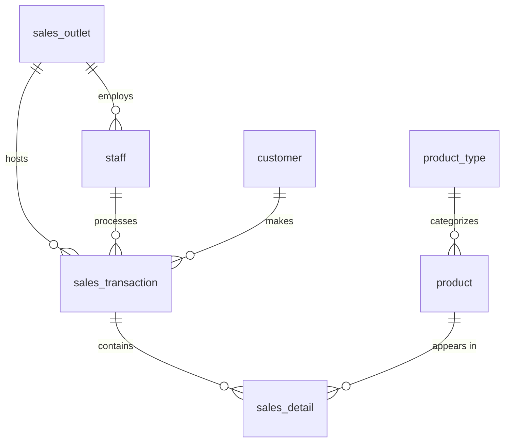

# Coffee Shop Relational Database — Design & Implementation


End-to-end relational database design for a coffee shop chain expanding into a multi-location franchise: from raw, scattered source data (POS exports, spreadsheets, a CRM) to a normalized 3NF schema, implemented and populated in PostgreSQL, with reporting objects exported and migrated to MySQL.

This repository contains two complementary deliverables from the same design problem — one built hands-on in a live database environment, one written as a full design document with runnable SQL.

## Table of Contents
- [Overview](#overview)
- [Skills Demonstrated](#skills-demonstrated)
- [Schema](#schema)
- [Repository Structure](#repository-structure)
- [Project 1 — Practical Build (PostgreSQL → MySQL)](#project-1--practical-build-postgresql--mysql)
- [Project 2 — Design Document & SQL](#project-2--design-document--sql)
- [Tech Stack](#tech-stack)

## Overview

A coffee shop chain's data is scattered across accounting software, a POS system, a CRM, and spreadsheets. The task: design a central relational database that consolidates this data, enforces data integrity, supports reporting for external partners (payroll, marketing), and can scale to new franchise locations.

## Skills Demonstrated

- **Requirements analysis** — extracting entities and attributes from unstructured, real-world sample data
- **Data modeling** — building an ERD and applying normalization (1NF → 3NF) to eliminate redundancy and update anomalies
- **Schema design** — primary/foreign keys, CHECK constraints, appropriate data typing
- **SQL DDL & DML** — table creation, constraints, data loading
- **Reporting objects** — views and materialized views for downstream consumers with different access needs
- **Cross-platform data migration** — exporting from PostgreSQL and importing into MySQL for partner systems

## Schema



## Repository Structure

```
.
├── project1-mysql-postgresql/     # Practical, hands-on implementation
│   ├── screenshots/                # Task 1–10 walkthrough
│   └── README.md
├── project2-text-sql/             # Design document + runnable SQL
│   ├── schema.sql
│   ├── views.sql
│   └── README.md
└── README.md                      # You are here
```

## Project 1 — Practical Build (PostgreSQL → MySQL)

Built the database live in pgAdmin: designed the ERD, normalized it, generated and ran the DDL, loaded sample data, created a view and a materialized view, and migrated the reporting outputs into MySQL for two external partners (a payroll company and a marketing consultant).

**[→ Full walkthrough with screenshots](./project1-mysql-postgresql/README.md)**

## Project 2 — Design Document & SQL

A complete written design covering entity identification, business rules, a 3NF logical schema, relationship definitions, and full SQL implementation (DDL with constraints, a view, and a materialized view).

**[→ Full write-up](./project2-text-sql/README.md)** · **[schema.sql](./project2-text-sql/schema.sql)** · **[views.sql](./project2-text-sql/views.sql)**

## Tech Stack

`PostgreSQL` · `MySQL` · `phpMyAdmin` · `pgAdmin (ERD tool)` · `SQL (DDL / DML / Views / Materialized Views)`

---
*Completed as the capstone for the "Relational Databases (RDBMS)" course.*
