# Project 1 — Practical Build: PostgreSQL → MySQL

A hands-on implementation of the coffee shop database: from raw source data to a normalized schema in PostgreSQL, with reporting objects exported and migrated into MySQL for two external partners.

## Workflow

### 1. Identify entities & attributes
Reviewed sample data from five source systems (staff spreadsheet, outlet spreadsheet, POS sales CSV, CRM customer CSV, supplier product spreadsheet) to identify the entities and attributes needed for the schema.

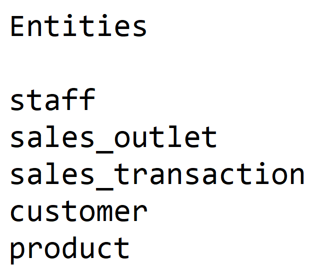
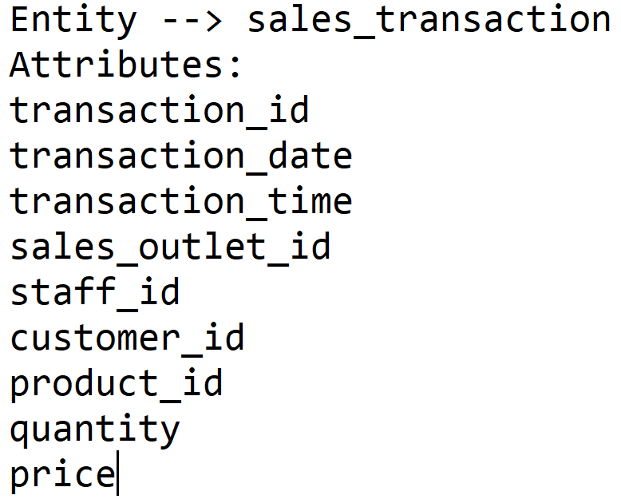

### 2. Build the initial ERD
Created a new `COFFEE` database in pgAdmin and modeled the `sales_transaction` and `product` tables in the ERD tool, choosing data types and naming conventions valid across RDBMS.

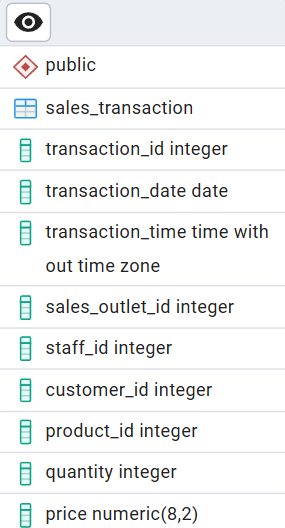
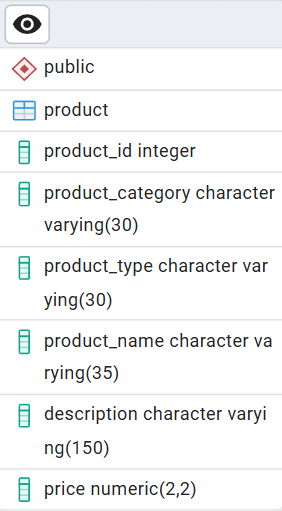

### 3. Normalize to 2NF
Split repeating groups out of `sales_transaction` into a new `sales_detail` table, and separated redundant category/type data out of `product` into a new `product_type` table.

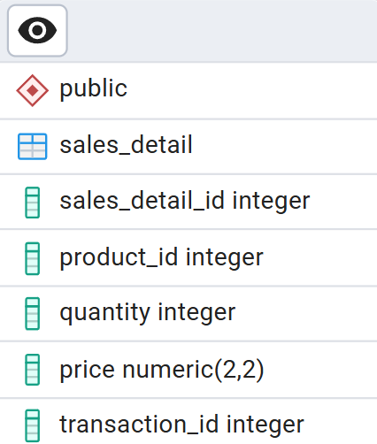
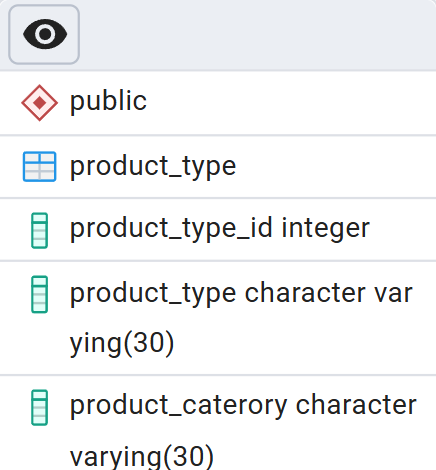

### 4. Define keys & relationships
Assigned primary keys to every table, then defined the relationships between `sales_detail` ↔ `sales_transaction`, `sales_detail` ↔ `product`, and `product` ↔ `product_type`.

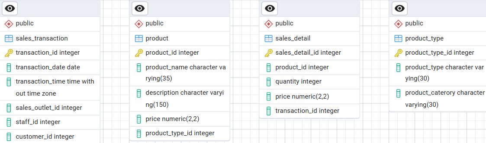
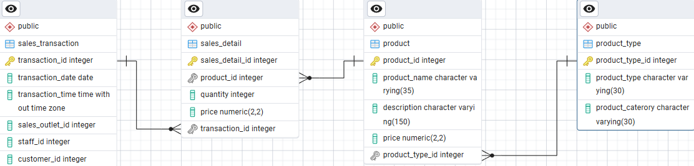

### 5. Generate schema & load data
Generated the SQL script from the finished ERD, ran it to create the schema, and loaded the sample dataset.

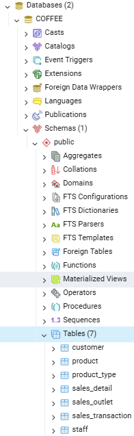
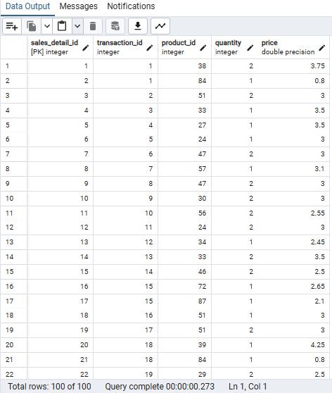

### 6. Create reporting objects
Built a **view** (`staff_locations_view`) for the external payroll company, excluding the CEO/CFO, and a **materialized view** (`product_info_m-view`) for a marketing consultant, joining product and category data. Exported both to CSV.

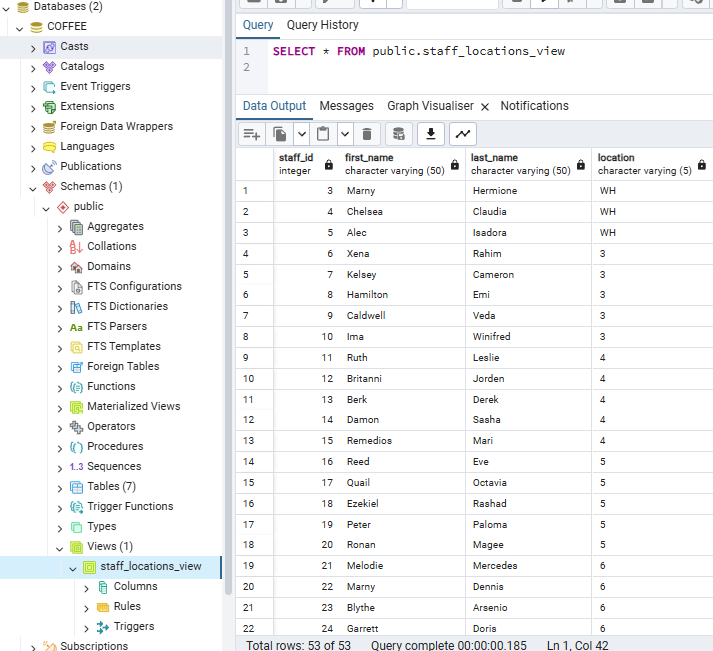
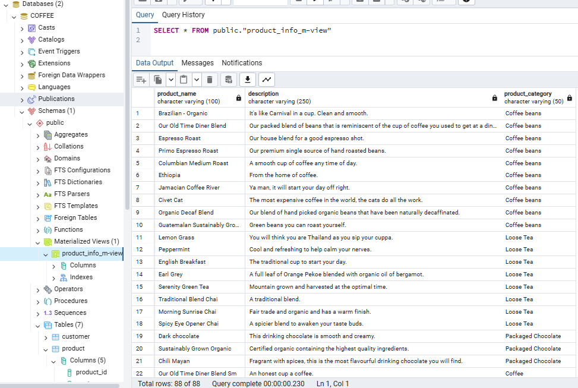

### 7. Migrate to MySQL
Imported the two exported CSVs into a MySQL instance via phpMyAdmin, one database per partner (`STAFF_LOCATIONS` and `coffee_shop_products`), simulating handoff to external systems.

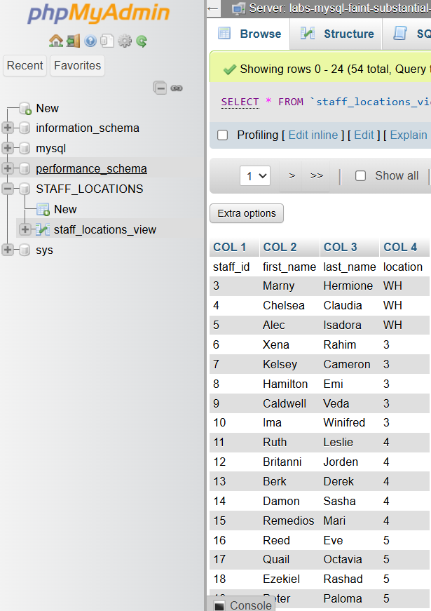
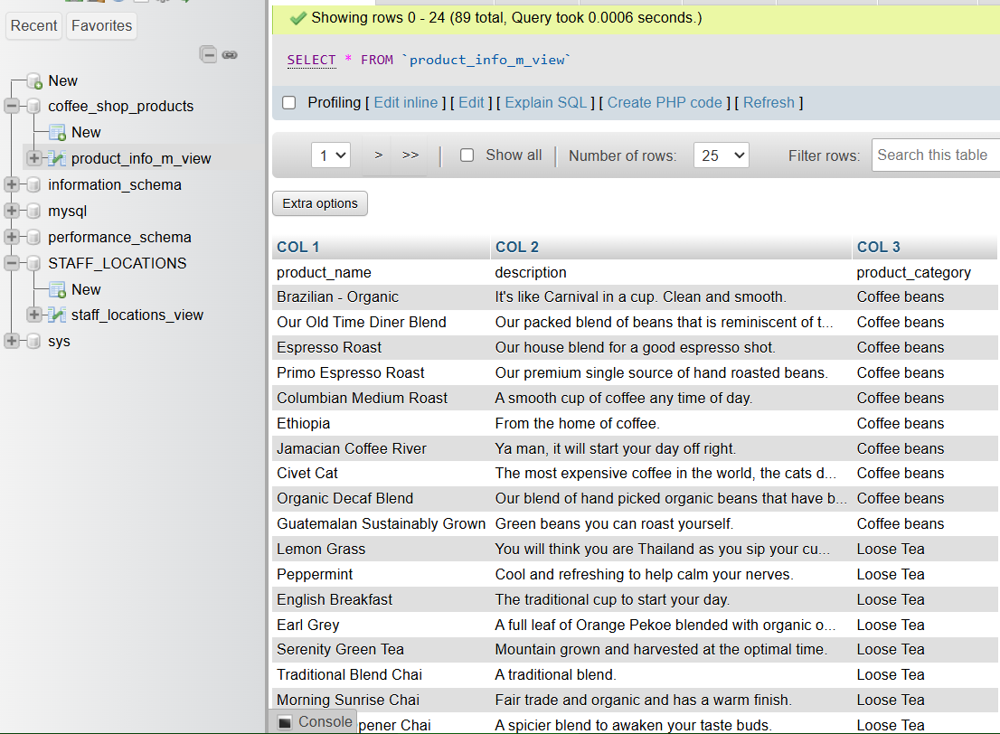

---
[← Back to main README](../README.md)
